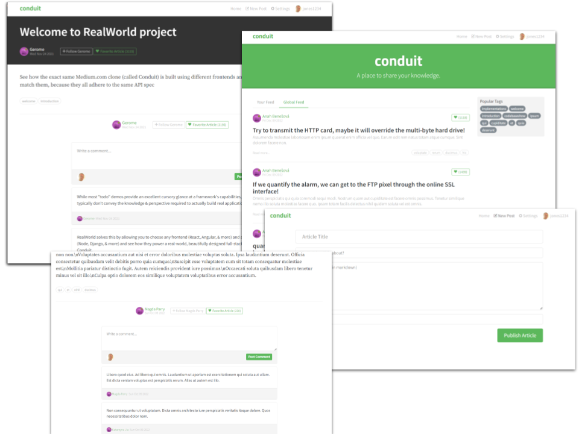

# 

This project is a reworking of [solid-realworld].

The following changes have be made:

- [X] Builds & runs with yarn/vite
- [X] Converted javascript source to fully typed typescript
- [X] Rationalised code and added extensive comments
- [X] Add Follow & Favorite to Article
- [X] Select an article page directly via URL/slug
- [X] Article comments now load
- [X] Replace server API client with one based directly on openAPI
- [X] Add diagnostic/debug logging

## LOC

| language | files | code | comment | blank | total |
| :--- | ---: | ---: | ---: | ---: | ---: |
| TypeScript JSX | 21 | 1,055 | 104 | 175 | 1,334 |
| TypeScript | 13 | 913 | 388 | 267 | 1,568 |
| CSS | 1 | 16 | 1 | 3 | 20 |

## Links

The canonical [realworld] project links.

* The reference demo for the project [demo.realworld.io]
* The demo source [angularjs-realworld-example-app]

[angularjs-realworld-example-app]: https://github.com/gothinkster/angularjs-realworld-example-app
[demo.realworld.io]: https://demo.realworld.io/#/
[realworld]:https://github.com/gothinkster/realworld
[solid-realworld]: https://github.com/solidjs/solid-realworld

